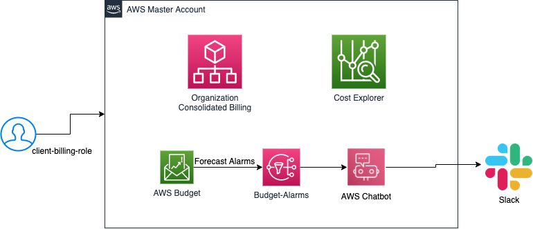

# terraform-aws-budget

Terraform module to add billing related AWS resources:

- AWS Budget
- SNS Budget Alarm
- AWS Chatbot integration to send notifications to Slack channel

<!--- BEGIN_TF_DOCS --->

## Requirements

| Name | Version |
|------|---------|
| terraform | >= 0.13.0 |

## Providers

| Name | Version |
|------|---------|
| aws | n/a |

## Inputs

| Name | Description | Type | Default | Required |
|------|-------------|------|---------|:--------:|
| budget\_ammount | The amount of cost or usage being measured for a budget. | `string` | `"0"` | no |
| budget\_email | E-Mail addresses to notify. | `string` | `""` | no |
| budget\_threshold\_percentage | The unit of measurement used for the budget forecast, actual spend, or budget threshold, such as dollars or GB. | `string` | `"60"` | no |
| budget\_time | The length of time until a budget resets the actual and forecasted spend. Valid values: MONTHLY, QUARTERLY, ANNUALLY. | `string` | `"MONTHLY"` | no |
| enable\_budget | Flag to enable AWS Budget cost control | `string` | `"false"` | no |
| enable\_chatbot\_slack | If true, will create aws chatboot and integrate to slack | `string` | `"false"` | no |
| org\_name | Name for this organization | `any` | n/a | yes |
| slack\_channel\_id | Sclack channel id to send budget notfication using AWS Chatbot | `string` | `""` | no |
| slack\_workspace\_id | Sclack workspace id to send budget notfication using AWS Chatbot | `string` | `""` | no |

## Outputs

No output.

<!--- END_TF_DOCS --->

## Authors

Module managed by [DNX Solutions](https://github.com/DNXLabs).

## License

Apache 2 Licensed. See [LICENSE](https://github.com/DNXLabs/terraform-aws-budget/blob/master/LICENSE) for full details.
